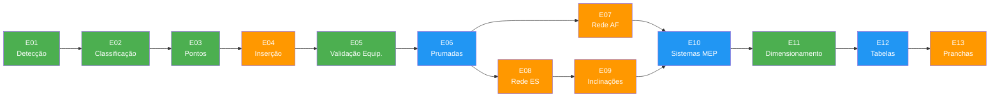
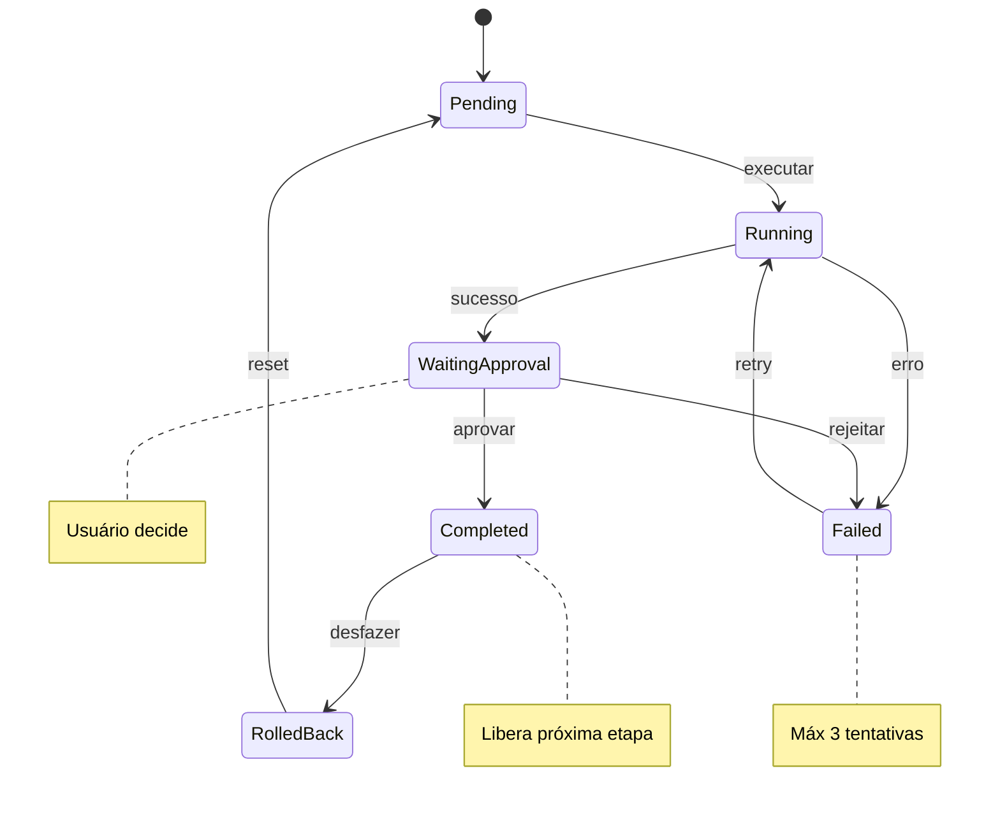
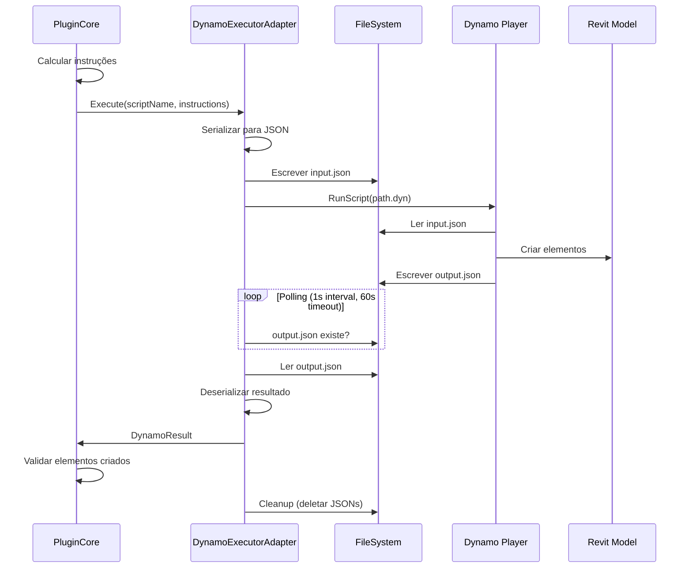
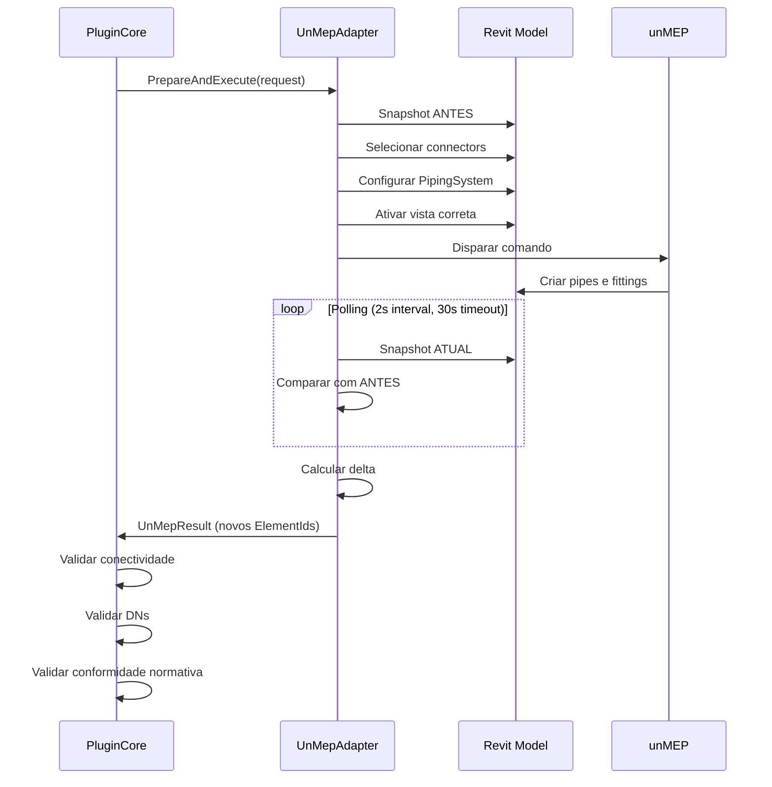
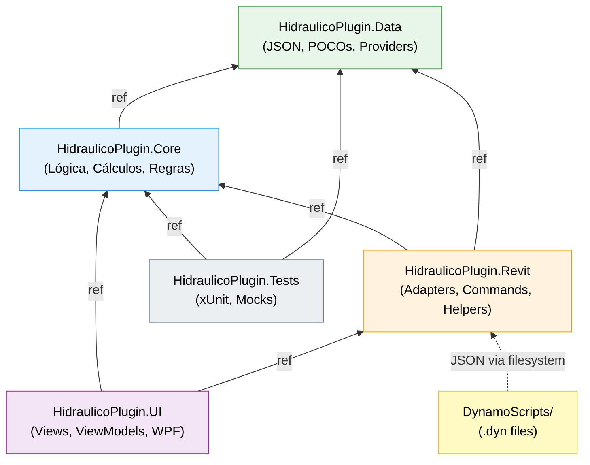
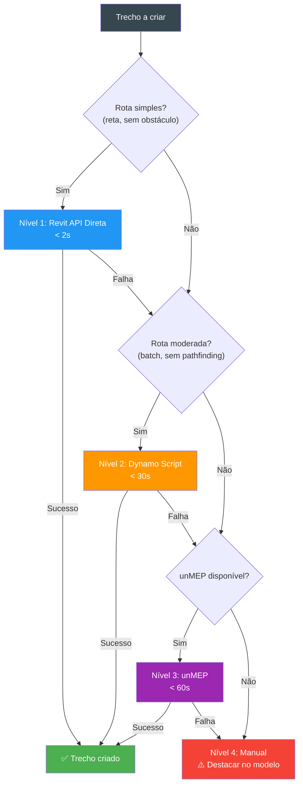
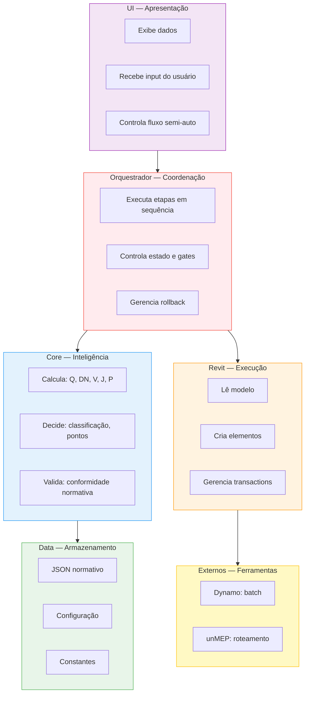

# Diagrama de Arquitetura Geral — Plugin Hidráulico Revit

> Representação visual completa da arquitetura do sistema em Mermaid.

---

## 1. Arquitetura Geral do Sistema

```mermaid
graph TD
    subgraph USUARIO["👤 Usuário / Engenheiro"]
        U_INPUT["Configurar + Executar + Aprovar"]
    end

    subgraph REVIT_HOST["Autodesk Revit 2026"]

        subgraph UI_LAYER["Camada UI — HidraulicoPlugin.UI"]
            UI_MAIN["MainWindow"]
            UI_CONFIG["ConfigTab"]
            UI_EXEC["ExecutionTab"]
            UI_DIAG["DiagnosticsTab"]
            UI_VM["ViewModels MVVM"]
        end

        subgraph ORCHESTRATOR["Orquestrador — PipelineEngine"]
            ORC_ENGINE["PipelineEngine"]
            ORC_STATE["PipelineState"]
            ORC_STAGES["13 Stages E01-E13"]
            ORC_ROLLBACK["RollbackManager"]
            ORC_GATE["Validation Gates"]
        end

        subgraph CORE_LAYER["Camada Core — HidraulicoPlugin.Core"]

            subgraph CORE_CLASS["Classificação"]
                CL_CLASSIFIER["RoomClassifier"]
                CL_NORMALIZER["NameNormalizer"]
            end

            subgraph CORE_POINTS["Pontos Hidráulicos"]
                PT_SERVICE["PointIdentificationService"]
                PT_PROVIDER["PointRequirementProvider"]
            end

            subgraph CORE_SIZING["Motor de Dimensionamento"]
                SZ_FLOW["FlowRateCalculator"]
                SZ_PIPE["PipeSizingService"]
                SZ_LOSS["HeadLossCalculator"]
                SZ_PRESS["PressureVerificationService"]
            end

            subgraph CORE_RULES["Motor Normativo"]
                RL_SLOPE["SlopeRules"]
                RL_VENT["VentilationRules"]
                RL_DIAM["DiameterRules"]
            end

            subgraph CORE_VALID["Validador"]
                VD_ENGINE["ValidationEngine"]
                VD_RULES["26 Regras VAL-NNN"]
                VD_AGGREG["ResultAggregator"]
            end

            subgraph CORE_LOG["Diagnóstico"]
                LOG_SVC["LogService"]
                LOG_EXPORT["LogExporter"]
            end

            subgraph CORE_ABS["Abstrações / Interfaces"]
                ABS_READER["IModelReader"]
                ABS_CREATOR["IElementCreator"]
                ABS_INSERTER["IEquipmentInserter"]
                ABS_DYNAMO["IDynamoExecutor"]
                ABS_SLOPE["ISlopeApplicator"]
                ABS_TX["ITransactionManager"]
            end
        end

        subgraph REVIT_LAYER["Camada Revit — HidraulicoPlugin.Revit"]

            subgraph REVIT_ADAPT["Adapters"]
                RA_READER["RevitModelReader"]
                RA_CREATOR["RevitElementCreator"]
                RA_INSERTER["RevitEquipmentInserter"]
                RA_SLOPE["RevitSlopeApplicator"]
                RA_SCHEDULE["RevitScheduleGenerator"]
                RA_TX["RevitTransactionManager"]
            end

            subgraph REVIT_DYN["Executor Dynamo"]
                DYN_ADAPTER["DynamoExecutorAdapter"]
                DYN_SERIAL["JSON Serializer"]
                DYN_POLL["Output Polling"]
            end

            subgraph REVIT_UNMEP["Executor unMEP"]
                UNMEP_ADAPTER["UnMepAdapter"]
                UNMEP_SNAP["ModelSnapshot"]
                UNMEP_VALID["UnMepValidator"]
            end

            subgraph REVIT_HELPERS["Helpers"]
                HLP_UNIT["UnitConversionHelper"]
                HLP_FILTER["FilterHelper"]
                HLP_PARAM["ParameterHelper"]
            end

            REVIT_CMD["Commands / ExternalEvents"]
            REVIT_REG["ServiceRegistry"]
        end

        subgraph DATA_LAYER["Camada Data — HidraulicoPlugin.Data"]
            DATA_JSON["referencia_normativa.json"]
            DATA_CONFIG["config/*.json"]
            DATA_PROVIDER["NormativeDataProvider"]
            DATA_CFGPROV["ConfigProvider"]
            DATA_CONST["NormativeConstants"]
            DATA_MODELS["Models / POCOs"]
        end
    end

    subgraph EXTERNAL["Ferramentas Externas"]
        EXT_DYNAMO["Dynamo Player"]
        EXT_UNMEP["unMEP"]
        EXT_REVITAPI["Revit API"]
    end

    subgraph DYNAMO_SCRIPTS["DynamoScripts"]
        DYN_04["04_InsertEquipment.dyn"]
        DYN_07["07_GenerateColdWaterNetwork.dyn"]
        DYN_08["08_GenerateSewerNetwork.dyn"]
        DYN_09["09_ApplySlopes.dyn"]
        DYN_13["13_GenerateSheets.dyn"]
    end

    subgraph FILESYSTEM["Sistema de Arquivos"]
        FS_INPUT["dynamo_input.json"]
        FS_OUTPUT["dynamo_output.json"]
        FS_STATE["pipeline_state.json"]
        FS_LOGS["logs/*.json"]
    end

    %% Fluxo do Usuário
    U_INPUT --> UI_MAIN
    UI_MAIN --> UI_VM
    UI_VM --> REVIT_CMD

    %% UI → Orquestrador
    REVIT_CMD --> ORC_ENGINE
    ORC_ENGINE --> ORC_STATE
    ORC_ENGINE --> ORC_STAGES
    ORC_ENGINE --> ORC_GATE
    ORC_ENGINE --> ORC_ROLLBACK
    ORC_GATE --> UI_VM

    %% Orquestrador → Core
    ORC_STAGES --> CL_CLASSIFIER
    ORC_STAGES --> PT_SERVICE
    ORC_STAGES --> SZ_FLOW
    ORC_STAGES --> SZ_PIPE
    ORC_STAGES --> VD_ENGINE
    ORC_STAGES --> LOG_SVC

    %% Core → Abstrações
    CL_CLASSIFIER --> ABS_READER
    PT_SERVICE --> DATA_PROVIDER
    SZ_FLOW --> DATA_PROVIDER
    SZ_PIPE --> DATA_PROVIDER
    RL_SLOPE --> DATA_PROVIDER
    RL_VENT --> DATA_PROVIDER
    VD_ENGINE --> VD_RULES

    %% Abstrações → Adapters (DIP)
    ABS_READER -.->|implementa| RA_READER
    ABS_CREATOR -.->|implementa| RA_CREATOR
    ABS_INSERTER -.->|implementa| RA_INSERTER
    ABS_DYNAMO -.->|implementa| DYN_ADAPTER
    ABS_SLOPE -.->|implementa| RA_SLOPE
    ABS_TX -.->|implementa| RA_TX

    %% Adapters → Revit API
    RA_READER --> EXT_REVITAPI
    RA_CREATOR --> EXT_REVITAPI
    RA_INSERTER --> EXT_REVITAPI
    RA_SLOPE --> EXT_REVITAPI
    RA_SCHEDULE --> EXT_REVITAPI
    RA_TX --> EXT_REVITAPI

    %% Dynamo Adapter → Scripts
    DYN_ADAPTER --> DYN_SERIAL
    DYN_SERIAL --> FS_INPUT
    FS_INPUT --> EXT_DYNAMO
    EXT_DYNAMO --> DYN_04
    EXT_DYNAMO --> DYN_07
    EXT_DYNAMO --> DYN_08
    EXT_DYNAMO --> DYN_09
    EXT_DYNAMO --> DYN_13
    EXT_DYNAMO --> FS_OUTPUT
    FS_OUTPUT --> DYN_POLL
    DYN_POLL --> DYN_ADAPTER

    %% unMEP Adapter
    UNMEP_ADAPTER --> UNMEP_SNAP
    UNMEP_ADAPTER --> EXT_UNMEP
    UNMEP_ADAPTER --> UNMEP_VALID

    %% Data
    DATA_PROVIDER --> DATA_JSON
    DATA_CFGPROV --> DATA_CONFIG
    DATA_PROVIDER --> DATA_MODELS

    %% Persistência
    ORC_STATE --> FS_STATE
    LOG_SVC --> FS_LOGS
    LOG_SVC --> LOG_EXPORT

    %% Registry
    REVIT_REG --> RA_READER
    REVIT_REG --> RA_CREATOR
    REVIT_REG --> DYN_ADAPTER
    REVIT_REG --> UNMEP_ADAPTER

    %% Helpers
    RA_READER --> HLP_UNIT
    RA_READER --> HLP_FILTER
    RA_CREATOR --> HLP_PARAM
```

---

## 2. Fluxo de Execução da Pipeline

**Legenda:**
- 🟢 Verde = Core (lógica pura)
- 🟠 Laranja = Dynamo / unMEP (execução externa)
- 🔵 Azul = Revit API direta

---

## 3. Máquina de Estados por Etapa

---

## 4. Fluxo de Comunicação Plugin ↔ Dynamo

---

## 5. Fluxo de Comunicação Plugin ↔ unMEP

---

## 6. Fluxo de Dependências entre Projetos

---

## 7. Cascata de Fallback para Criação de Redes

---

## 8. Visão por Camada — Responsabilidades

